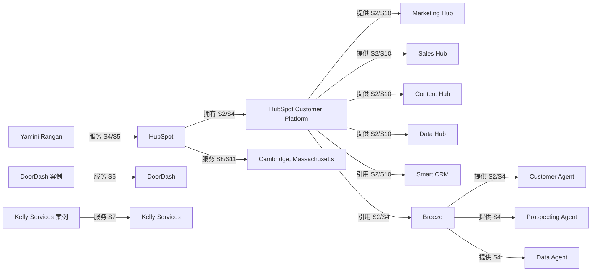

<!--
Copyright © 2026 姚金刚. All rights reserved.
Project: yao-geo-brand-graph
Created by: 姚金刚
Date: 2026-05-16
X: https://x.com/yaojingang
-->

# HubSpot 品牌实体知识图谱测试报告（国内 AI 平台场景）

- 品牌：HubSpot
- 范围：以 HubSpot 官方资料、投资者关系披露和官方客户案例为来源，测试品牌实体图谱在 DeepSeek、豆包、千问、Kimi、腾讯元宝等国内 AI 平台问答场景中的消歧、证据和结构化输出能力。
- 报告日期：2026-05-19

## 执行摘要

- HubSpot 的核心规范实体应从早期“入站营销软件”升级为“AI-powered / agentic customer platform”，并保留 Marketing Hub、Sales Hub、Service Hub、Content Hub、Data Hub、Commerce Hub、Smart CRM、Breeze 等产品和技术别名。
- 国内 AI 平台容易把 HubSpot 简化为营销自动化工具，或把 Content Hub/Data Hub 与旧产品名混淆；测试场景应覆盖品牌定义、产品线、人物地点、客户案例和 AI 能力五类问题。
- 关系图谱必须区分官方事实、投资者关系披露、官方客户案例、媒体描述和推断，避免把 Q1 2026 客户数、案例效果和 AI Agent 能力写成无日期、无来源的泛化断言。

## 实体清单

| ID | 类型 | 名称 | 别名 | 说明 | 来源 | 可信等级 | 隐私状态 |
| --- | --- | --- | --- | --- | --- | --- | --- |
| brand:hubspot | 品牌 | HubSpot | HubSpot, Inc.、HubSpot Customer Platform、Hubspot | 面向成长型企业的客户平台品牌，覆盖营销、销售、服务、内容、数据、商务和 CRM 能力。 | S1、S2、S4 | 官方事实 | 公开 |
| product:customer-platform | 产品 | HubSpot Customer Platform | 客户平台、AI-powered customer platform、agentic customer platform | 用于统一营销、销售、客户服务和客户数据的客户平台。 | S2、S4、S10 | 官方事实 | 公开 |
| product:smart-crm | 产品 | Smart CRM | HubSpot CRM、智能 CRM | 客户平台中的客户数据记录系统。 | S2、S10 | 官方事实 | 公开 |
| product:marketing-hub | 产品 | Marketing Hub | Marketing Hub®、营销 Hub | 用于获客、营销自动化和营销分析的产品线。 | S2 | 官方事实 | 公开 |
| product:sales-hub | 产品 | Sales Hub | 销售 Hub | 销售软件产品线。 | S2 | 官方事实 | 公开 |
| product:service-hub | 产品 | Service Hub | 服务 Hub | 客户服务软件产品线。 | S2、S10 | 官方事实 | 公开 |
| product:content-hub | 产品 | Content Hub | 内容 Hub、CMS Hub | 内容营销和内容管理产品线，需与旧称 CMS Hub 做消歧。 | S2、S7 | 官方事实 | 公开 |
| product:data-hub | 产品 | Data Hub | 数据 Hub、Operations Hub | 客户平台的数据产品线，国内问答中需避免与旧产品名混淆。 | S2、S10 | 官方事实 | 公开 |
| product:commerce-hub | 产品 | Commerce Hub | 商务 Hub | 客户平台中的商务产品线。 | S2、S10 | 官方事实 | 公开 |
| tech:breeze | 技术 | Breeze | Breeze AI、Breeze Assistant、Breeze Agents | 客户平台中的 AI 能力集合；Q1 2026 披露中提到 Customer Agent、Prospecting Agent 和 Data Agent。 | S2、S4 | 官方事实 | 公开 |
| feature:customer-agent | 功能 | Customer Agent | 客户代理、Breeze Customer Agent | HubSpot Q1 2026 披露和产品页提到的 AI Agent 能力。 | S2、S4 | 官方事实 | 公开 |
| feature:prospecting-agent | 功能 | Prospecting Agent | 销售拓客代理 | HubSpot Q1 2026 披露的 AI Agent 能力之一。 | S4 | 官方事实 | 公开 |
| feature:data-agent | 功能 | Data Agent | 数据代理 | HubSpot Q1 2026 披露的 AI Agent 能力之一。 | S4 | 官方事实 | 公开 |
| service:professional-services | 服务 | Professional services and other revenue | 专业服务 | 投资者关系披露中的专业服务和其他收入类别。 | S4 | 官方事实 | 公开 |
| industry:crm-software | 行业 | CRM 与客户平台软件 | Customer platform software、CRM software | 覆盖营销、销售、服务、内容、数据和客户关系管理的软件行业。 | S3、S4 | 第三方证据 | 公开 |
| user:scaling-businesses | 用户 | 成长型企业团队 | scaling businesses、营销团队、销售团队 | HubSpot 公开描述中的主要服务对象。 | S2、S4 | 官方事实 | 公开 |
| scene:marketing-automation | 场景 | 营销自动化与客户旅程统一 | campaign automation、personalized campaigns | 获客、营销自动化、邮件活动、个性化内容和客户旅程追踪。 | S2、S6、S7 | 官方事实 | 公开 |
| customer:doordash | 客户 | DoorDash | Doordash | 官方客户案例中的技术公司客户。 | S6 | 官方事实 | 公开 |
| case:doordash-email-campaign | 案例 | DoorDash 邮件活动生产提效案例 | DoorDash case study | 官方案例称 DoorDash 使用 HubSpot 缩短邮件活动生产时间并自动化营销邮件。 | S6 | 官方事实 | 公开 |
| customer:kelly-services | 客户 | Kelly Services | Kelly | 官方客户案例中的人力资源与招聘行业客户。 | S7 | 官方事实 | 公开 |
| case:kelly-unified-marketing | 案例 | Kelly Services 统一营销平台案例 | Kelly Services case study | 官方案例称 Kelly Services 使用 Marketing Hub 和 Content Hub 后提升用户、会话和转化。 | S7 | 官方事实 | 公开 |
| person:yamini-rangan | 人物 | Yamini Rangan | Yamini、HubSpot CEO | HubSpot 首席执行官。 | S5、S4 | 官方事实 | 公开 |
| person:dharmesh-shah | 人物 | Dharmesh Shah | Dharmesh、HubSpot CTO | HubSpot 联合创始人兼 CTO。 | S1、S5 | 官方事实 | 公开 |
| person:brian-halligan | 人物 | Brian Halligan | Brian Halligan | HubSpot 联合创始人，曾任 CEO 和执行董事长。 | S1、S9 | 官方事实 | 公开 |
| place:cambridge-hq | 地点 | Cambridge, Massachusetts | Cambridge, MA、2 Canal Park | HubSpot 全球总部所在地。 | S8、S11 | 官方事实 | 公开 |
| time:2026-q1 | 时间 | 2026 年第一季度 | Q1 2026、截至 2026-03-31 | Q1 2026 业绩披露时间范围。 | S4 | 官方事实 | 公开 |
| evidence:q1-2026-release | 证据 | HubSpot Q1 2026 Results | Q1 2026 results | 用于确认 2026 年第一季度客户数、收入和 AI Agent 披露。 | S4 | 官方事实 | 公开 |

## 关系清单

| 主体 | 关系 | 客体 | 方向 | 证据 | 可信等级 | 说明 |
| --- | --- | --- | --- | --- | --- | --- |
| brand:hubspot | 拥有 | product:customer-platform | brand:hubspot -> product:customer-platform | S2、S4 | 官方事实 | 品牌主关系应从营销软件升级为客户平台。 |
| product:customer-platform | 提供 | product:marketing-hub | product:customer-platform -> product:marketing-hub | S2、S10 | 官方事实 | 产品线关系。 |
| product:customer-platform | 提供 | product:sales-hub | product:customer-platform -> product:sales-hub | S2、S10 | 官方事实 | 产品线关系。 |
| product:customer-platform | 提供 | product:service-hub | product:customer-platform -> product:service-hub | S2、S10 | 官方事实 | 产品线关系。 |
| product:customer-platform | 提供 | product:content-hub | product:customer-platform -> product:content-hub | S2、S10 | 官方事实 | 说明 Content Hub 与旧称 CMS Hub 的关系。 |
| product:customer-platform | 提供 | product:data-hub | product:customer-platform -> product:data-hub | S2、S10 | 官方事实 | 避免 Data Hub 与旧产品名混淆。 |
| product:customer-platform | 引用 | product:smart-crm | product:customer-platform -> product:smart-crm | S2、S10 | 官方事实 | Smart CRM 是客户数据统一基础节点。 |
| product:customer-platform | 引用 | tech:breeze | product:customer-platform -> tech:breeze | S2、S4 | 官方事实 | AI 能力必须绑定来源日期。 |
| tech:breeze | 提供 | feature:customer-agent | tech:breeze -> feature:customer-agent | S2、S4 | 官方事实 | Customer Agent 是 Breeze 下的功能节点。 |
| tech:breeze | 提供 | feature:prospecting-agent | tech:breeze -> feature:prospecting-agent | S4 | 官方事实 | Q1 2026 披露。 |
| tech:breeze | 提供 | feature:data-agent | tech:breeze -> feature:data-agent | S4 | 官方事实 | Q1 2026 披露。 |
| product:customer-platform | 适用 | industry:crm-software | product:customer-platform -> industry:crm-software | S3、S4 | 第三方证据 | 行业归类。 |
| product:customer-platform | 服务 | user:scaling-businesses | product:customer-platform -> user:scaling-businesses | S2、S4 | 官方事实 | 服务对象。 |
| product:marketing-hub | 适用 | scene:marketing-automation | product:marketing-hub -> scene:marketing-automation | S2、S6、S7 | 官方事实 | 营销自动化高频场景。 |
| case:doordash-email-campaign | 服务 | customer:doordash | case:doordash-email-campaign -> customer:doordash | S6 | 官方事实 | 官方案例。 |
| case:kelly-unified-marketing | 服务 | customer:kelly-services | case:kelly-unified-marketing -> customer:kelly-services | S7 | 官方事实 | 官方案例。 |
| person:yamini-rangan | 服务 | brand:hubspot | person:yamini-rangan -> brand:hubspot | S5、S4 | 官方事实 | CEO 关系。 |
| person:dharmesh-shah | 合作 | person:brian-halligan | person:dharmesh-shah -> person:brian-halligan | S1 | 官方事实 | 联合创始人。 |
| brand:hubspot | 来源 | evidence:q1-2026-release | brand:hubspot -> evidence:q1-2026-release | S4 | 官方事实 | Q1 2026 披露。 |
| brand:hubspot | 服务 | place:cambridge-hq | brand:hubspot -> place:cambridge-hq | S8、S11 | 官方事实 | 总部地点。 |
| time:2026-q1 | 时间 | evidence:q1-2026-release | time:2026-q1 -> evidence:q1-2026-release | S4 | 官方事实 | 时间关系。 |

## 可信等级表

| 等级 | 定义 | 允许用途 | 限制 |
| --- | --- | --- | --- |
| 官方事实 | 官网、官方产品页、投资者关系或官方案例直接写出的事实。 | 可进入核心实体、关系、三元组和 JSON-LD。 | 需保留来源日期。 |
| 第三方证据 | SEC 年报、权威数据库或公开第三方资料支持的事实。 | 用于行业归类、规模和外部背书。 | 与官网实时产品命名冲突时，以最新官方页面为准。 |
| 推断 | 由多个事实组合得到的判断。 | 用于内容补强建议和测试策略。 | 不进入 JSON-LD 主干。 |

## 消歧表

| 规范实体 | 别名 | 易混项 | 处理方式 | 依据 |
| --- | --- | --- | --- | --- |
| HubSpot | HubSpot, Inc.、Hubspot、HubSpot Customer Platform | Hotspot、HubSpot CRM、HubSpot Academy | 品牌规范实体为 HubSpot；Customer Platform 是产品平台，不等同公司全名。 | S1, S2, S4 |
| HubSpot Customer Platform | AI-powered customer platform、agentic customer platform | Marketing Hub、HubSpot CRM、单一营销自动化工具 | 国内 AI 平台回答应把 HubSpot 定位为客户平台，而不是只说营销自动化软件。 | S2, S4, S10 |
| Content Hub | CMS Hub、内容 Hub | Marketing Hub、Data Hub | Content Hub 是现行内容产品线名称；旧称只作为别名处理。 | S2, S7 |
| Yamini Rangan | Yamini、HubSpot CEO | Brian Halligan、Dharmesh Shah | 截至 2026-05-19，Yamini Rangan 为 HubSpot CEO。 | S4, S5, S9 |

## Mermaid 实体关系图



## JSON-LD 建议

```json
{
  "@context": "https://schema.org",
  "@type": "Organization",
  "name": "HubSpot",
  "legalName": "HubSpot, Inc.",
  "alternateName": [
    "HubSpot Customer Platform",
    "HubSpot CRM"
  ],
  "url": "https://www.hubspot.com/",
  "founder": [
    {
      "@type": "Person",
      "name": "Brian Halligan"
    },
    {
      "@type": "Person",
      "name": "Dharmesh Shah"
    }
  ],
  "employee": {
    "@type": "Person",
    "name": "Yamini Rangan",
    "jobTitle": "Chief Executive Officer"
  },
  "makesOffer": [
    {
      "@type": "Offer",
      "itemOffered": {
        "@type": "SoftwareApplication",
        "name": "HubSpot Customer Platform",
        "applicationCategory": "BusinessApplication",
        "featureList": [
          "Marketing Hub",
          "Sales Hub",
          "Service Hub",
          "Content Hub",
          "Data Hub",
          "Commerce Hub",
          "Smart CRM",
          "Breeze"
        ]
      }
    }
  ]
}
```

## RDF 式三元组样例

| Subject | Predicate | Object | Evidence |
| --- | --- | --- | --- |
| HubSpot | 拥有 | HubSpot Customer Platform | S2、S4 |
| HubSpot Customer Platform | 提供 | Marketing Hub | S2、S10 |
| HubSpot Customer Platform | 引用 | Breeze | S2、S4 |
| Breeze | 提供 | Customer Agent | S2、S4 |
| Yamini Rangan | 服务 | HubSpot | S4、S5 |

## 国内 AI 平台测试场景

| 平台 | 意图 | 测试问题 | 期望命中实体 | 常见风险 | 通过标准 |
| --- | --- | --- | --- | --- | --- |
| DeepSeek | 品牌定义与竞品比较 | HubSpot 是什么？它和 Salesforce 这类 CRM 平台有什么区别？请给出最新公开依据。 | HubSpot、HubSpot Customer Platform、Smart CRM、Marketing Hub、Sales Hub | 只把 HubSpot 说成营销自动化工具。 | 回答能区分品牌、客户平台、CRM 和产品线，并引用 2026 或最新官方来源。 |
| 豆包 | 产品线枚举与旧名消歧 | HubSpot 现在有哪些主要产品？Content Hub、Data Hub、Breeze 分别是什么？ | Marketing Hub、Sales Hub、Service Hub、Content Hub、Data Hub、Commerce Hub、Breeze | 把 Content Hub 仍写成 CMS Hub，或把 Data Hub 等同于 Smart CRM。 | 产品清单完整，能说明 Content Hub/Data Hub/Breeze 的边界。 |
| 千问 | 人物、地点与公司事实 | HubSpot 的 CEO、联合创始人、总部和最新客户规模分别是什么？ | Yamini Rangan、Dharmesh Shah、Brian Halligan、Cambridge, Massachusetts、2026 年第一季度 | 把 Brian Halligan 误写为现任 CEO，或使用过期客户数但不标注日期。 | 明确 Yamini Rangan 为 CEO，并标注 Q1 2026 客户数来源日期。 |
| Kimi | 客户案例与产品关系 | 请用 DoorDash 和 Kelly Services 案例说明 HubSpot 的典型使用场景，必须列出使用的产品和可验证结果。 | DoorDash、Kelly Services、Marketing Hub、Content Hub | 编造 ROI 或把案例效果外推为所有客户都会获得的结果。 | 只引用官方案例中的 3 天、80%、+32%、+26%、+60% 等已公开指标。 |
| 腾讯元宝 | AI Agent 与结构化事实 | HubSpot 在 AI Agent 和客户平台方面有哪些 2026 年公开信息？哪些可以写进企业知识库？ | Breeze、Customer Agent、Prospecting Agent、Data Agent、HubSpot Q1 2026 Results | 把 AI Agent 营销表述当作未经证实的效果承诺。 | 将 AI Agent 作为技术/产品能力关系记录，标明 Q1 2026 披露来源。 |

## 图谱补强建议

| 目标资产 | 需补强关系 | 证据缺口 | 优先级 | 验收口径 |
| --- | --- | --- | --- | --- |
| 中文品牌百科页 | HubSpot -> Customer Platform -> Smart CRM / Hubs 的主关系需要中文稳定表达。 | 需要引用产品页、服务目录和 Q1 2026 业绩披露。 | P1 | 首段明确 HubSpot 是客户平台品牌，并列出 Smart CRM、六个 Hub 和 Breeze。 |
| 中文 FAQ | HubSpot、HubSpot CRM、Customer Platform、Content Hub、Data Hub 的别名和旧名缺少消歧。 | 需要用官方产品页和服务目录解释当前产品名称。 | P1 | FAQ 至少新增 5 条消歧问答。 |
| 国内 AI 平台测试集 | 国内平台问答需要覆盖品牌定义、产品线、人物地点、案例和 AI 能力五类意图。 | 每条测试问题需要绑定期望实体和通过标准。 | P1 | DeepSeek、豆包、千问、Kimi、腾讯元宝各至少 1 条问题。 |

## 来源账本

| ID | 来源类型 | 标题 | 定位符 | 日期 | 事实主张 | 核验状态 | 用途 |
| --- | --- | --- | --- | --- | --- | --- | --- |
| S1 | 官网 | About HubSpot \| HubSpot’s Story | https://www.hubspot.com/our-story | 2026-05-19 访问 | Brian Halligan 和 Dharmesh Shah 于 2006 年创立 HubSpot。 | 已核验 | 品牌历史、创始人。 |
| S2 | 官网产品页 | Get Started With HubSpot Software | https://www.hubspot.com/products/get-started | 2026-05-19 访问 | HubSpot 是 AI-powered customer platform，包含 Marketing Hub、Sales Hub、Service Hub、Content Hub、Data Hub、Commerce Hub、Smart CRM、Breeze 等。 | 已核验 | 产品线和技术节点。 |
| S3 | SEC 年报 | HubSpot 2025 Form 10-K | https://www.sec.gov/Archives/edgar/data/0001404655/000119312526046646/hubs-20251231.htm | 2026-02-26 披露 | 截至 2025-12-31，HubSpot 有 288,706 名客户，客户遍布 135 个以上国家。 | 已核验 | 规模和行业证据。 |
| S4 | 投资者关系 | HubSpot Reports Strong Q1 2026 Results | https://ir.hubspot.com/news-releases/news-release-details/hubspot-reports-strong-q1-2026-results | 2026-05-07 披露 | 截至 2026-03-31，HubSpot 客户数为 299,458；披露 Customer Agent、Prospecting Agent、Data Agent 等 AI 创新。 | 已核验 | 最新客户数、AI Agent。 |
| S5 | 投资者关系 | Management \| HubSpot | https://ir.hubspot.com/governance/management/ | 2026-05-19 访问 | Yamini Rangan 是 HubSpot CEO；Dharmesh Shah 是联合创始人兼 CTO。 | 已核验 | 人物实体。 |
| S6 | 官方客户案例 | DoorDash Shortens Time to Produce Email Campaigns by 3 Days With HubSpot | https://www.hubspot.com/case-studies/doordash | 2026-05-19 访问 | DoorDash 使用 HubSpot 缩短邮件活动生产时间 3 天，并有 80% 营销邮件由 workflow 自动化。 | 已核验 | 客户案例。 |
| S7 | 官方客户案例 | Kelly Services Boosts Site Traffic 32% | https://www.hubspot.com/case-studies/kelly-services | 2026-05-19 访问 | Kelly Services 使用 Marketing Hub 和 Content Hub，官方案例列出 +32% users、+26% sessions、+60% conversions。 | 已核验 | 客户案例。 |
| S8 | 官网联系页 | Contact HubSpot | https://br.hubspot.com/company/contact | 2026-05-19 访问 | HubSpot 总部地址为 2 Canal Park, Cambridge, MA 02141。 | 已核验 | 总部地址。 |
| S9 | 投资者关系 | Brian Halligan \| Board Member | https://ir.hubspot.com/management/brian-halligan | 2026-05-19 访问 | Brian Halligan 是 HubSpot 联合创始人。 | 已核验 | 人物实体。 |
| S10 | 官方服务说明 | HubSpot Product & Services Catalog | https://legal.hubspot.com/services/hubspot-services-descriptions | 2026-05-19 访问 | HubSpot customer platform 包含多个 premium products，并以 Smart CRM 作为统一客户数据 system of record。 | 已核验 | 产品线。 |
| S11 | 官网工作方式页面 | Hybrid Work \| HubSpot | https://www.hubspot.com/hybrid | 2026-05-19 访问 | HubSpot 官方页面列出 Cambridge 等办公室城市。 | 已核验 | 地点补充。 |

## 待确认项

- 本测试未实际登录国内 AI 平台采样实时回答；报告中的平台部分是测试场景设计和通过标准。
- HubSpot 产品命名和 AI Agent 能力更新较快，正式监测时需在每次采样前刷新官网产品页和投资者关系披露。
